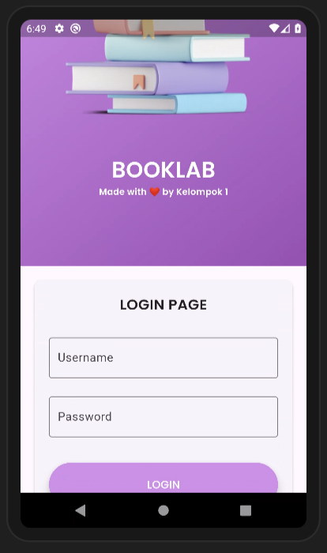
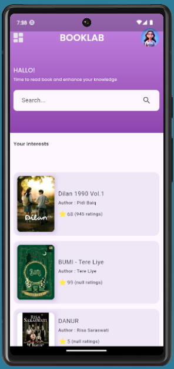
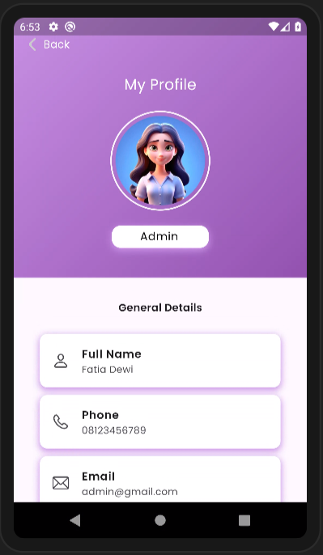
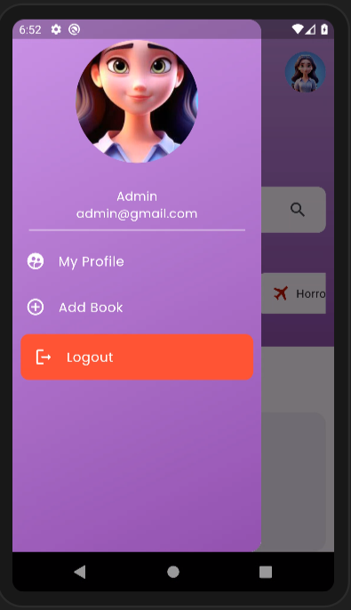
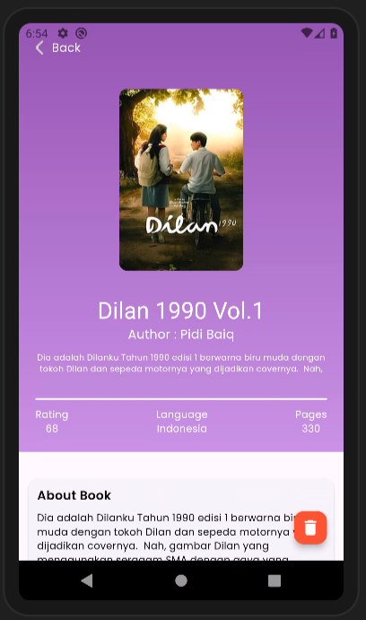
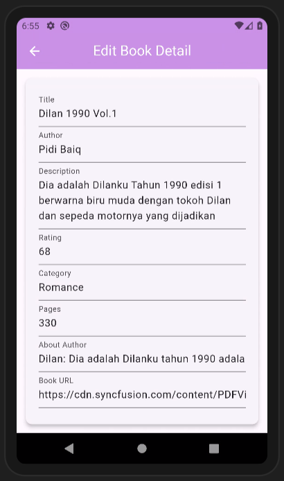
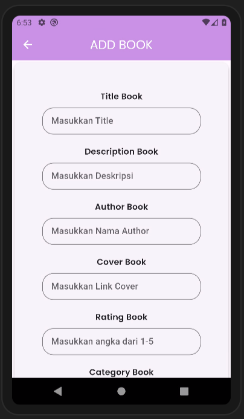
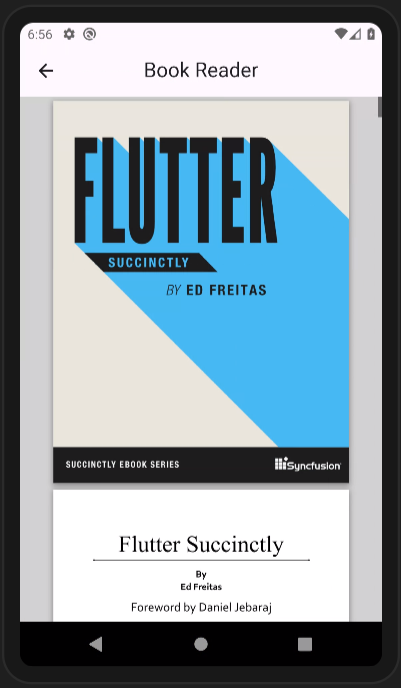

# BookLab App

 

Aplikasi BookLab sebagai alat efektif untuk mendukung tujuan tersebut. Melalui kemajuan teknologi mobile dan internet, aplikasi BookLab memberikan minat membaca dengan mudah.Penggunaan data dan analitika memudahkan untuk membaca novel . Dengan adanya aplikasi BookLab, memiliki potensi besar dalam mempengaruhi kebiasaan pengguna untuk minat membaca.

## Kelompok 2
<table border="1">
  <thead>
    <tr>
      <td>No</td>
      <td>NIM</td>
      <td>Nama Anggota</td>
    </tr>
  <thead>
  <tbody>
    <tr>
      <td>1</td>
      <td>19221571</td>
      <td>Miya Karomiyah</td>
    </tr>
    <tr>
      <td>2</td>
      <td>19220313</td>
      <td>Fatia Dewi Azani</td>
    </tr>
    <tr>
      <td>3</td>
      <td>19221429</td>
      <td>Salsabila Zahro</td>
    </tr>
    <tr>
      <td>4</td>
      <td>19220495</td>
      <td>Angelika Eveline</td>
    </tr>
    <tr>
      <td>5</td>
      <td>19220518</td>
      <td>Fidiyawati Sulay</td>
    </tr>
  </tbody>
</table>

## 💻 Pengguna Sistem
Pengguna yang dapat memakai sistem ini adalah Admin.

## 👨‍💻 Skenario Kebutuhan Pengguna
### Admin
<ol>
  <li>Admin dapat melakukan login.</li>
  <li>Admin dapat melihat, menambahkan, mengedit, dan menghapus data buku.</li>
  <li>Admin dapat menampilkan pdf buku yang akan dibaca</li>
</ol>

## 🖼️ Screenshot Aplikasi
<table width="100%">
  <tbody>
    <tr>
      <td width="33%">
        <h5>SplashScreen</h5>
         
      </td>
      <td width="33%">
        <h5>Login</h5>
        
      </td>
      <td width="33%">
        <h5>Home</h5>
        
      </td>
    </tr>
  </tbody>
</table>

<table width="100%">
  <tbody>
    <tr>
      <td width="33%">
        <h5>Profile</h5>
        
      </td>
      <td width="33%">
        <h5>Sidebar</h5>
        
      </td>
      <td width="33%">
        <h5>Detail Buku</h5>
        
      </td>
    </tr>
  </tbody>
</table>

<table width="100%">
  <tbody>
    <tr>
      <td width="33%">
        <h5>Edit Buku</h5>
        
      </td>
      <td width="33%">
        <h5>Tambah Buku</h5>
        
      </td>
      <td width="33%">
        <h5>Pembaca Buku</h5>
        
      </td>
    </tr>
  </tbody>
</table>

## 📝 Prerequisite
Untuk menjalankan aplikasi ini disarankan untuk menyiapkan aplikasi berikut ini :
  - [x] Android Studio Giraffe <code>2022.03.1 Patch 1</code>
  - [x] Flutter <code>3.13.2</code>
  - [x] Dart <code>3.1.0</code>
  - [x] Java JDK <code>19.0.0</code>
  - [x] Git <code>2.35.1</code>

## 📝 PPT
Kelompok 1: https://docs.google.com/presentation/d/1BkZpSQ1BdN-A2bHefsFnps72mfuK9jYM/edit?usp=sharing&ouid=106457358241163902459&rtpof=true&sd=true

## Credit
Project ini mengacu pada modul praktik dari mata kuliah Mobile Programming Universitas Bina Sarana Informatika (UBSI) yang diampu oleh Bpk.  <a href="https://github.com/yuris60">Yuris Alkhalifi, M.Kom., CPDSA</a> selaku Dosen.
#